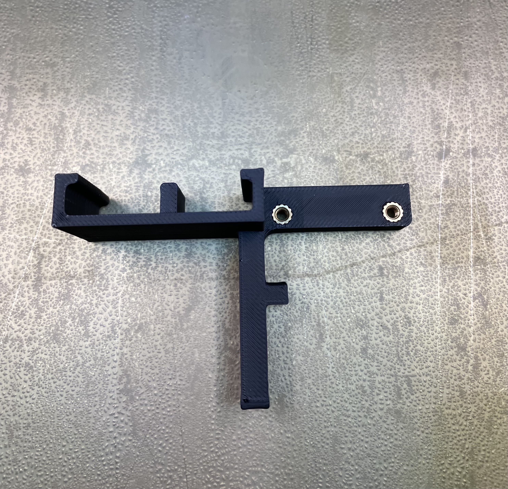
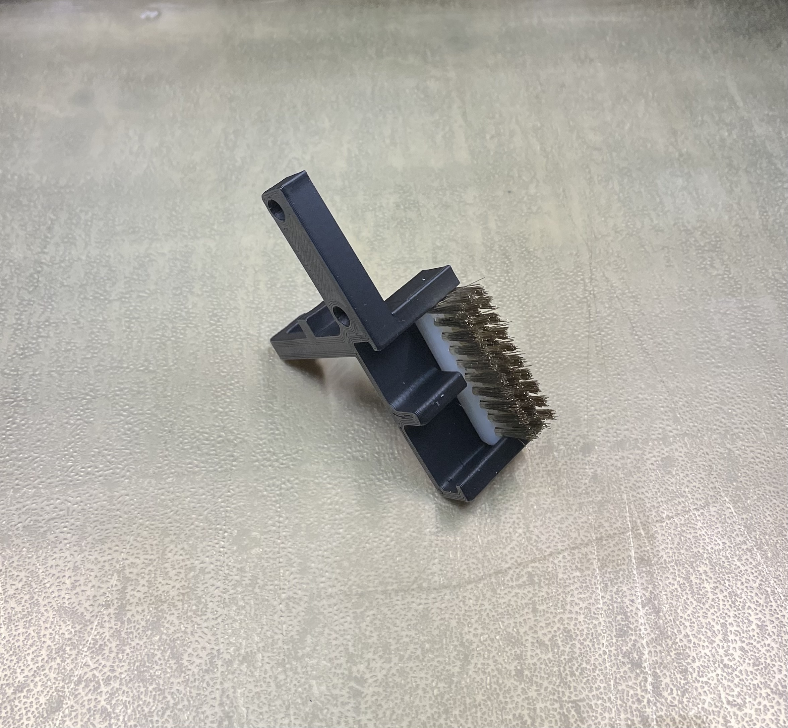
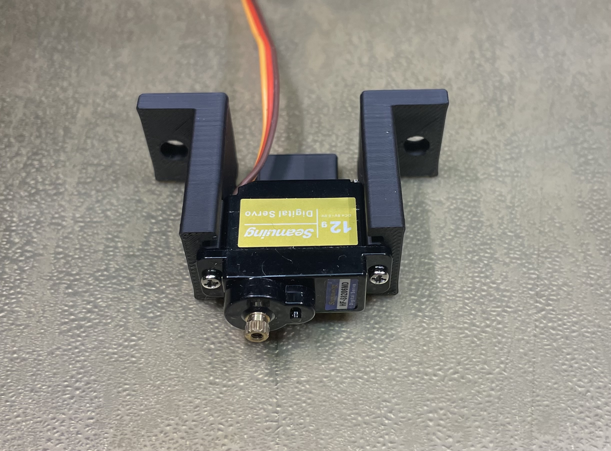
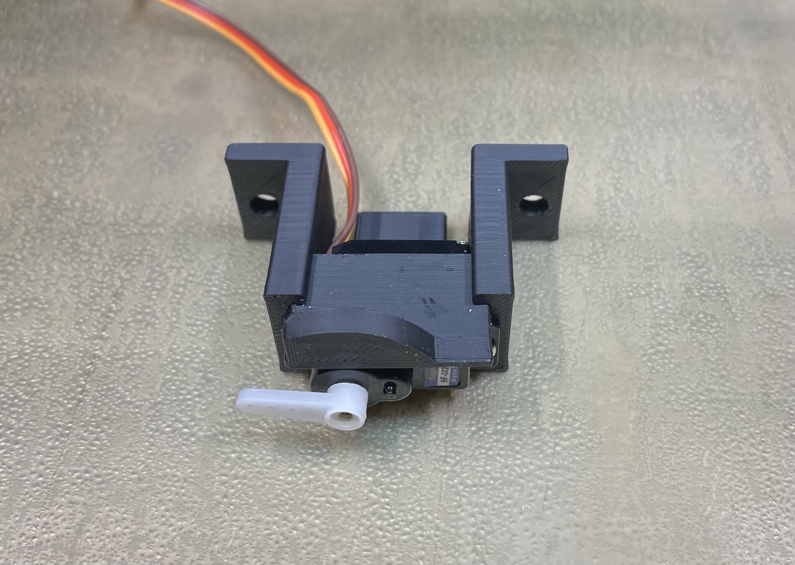
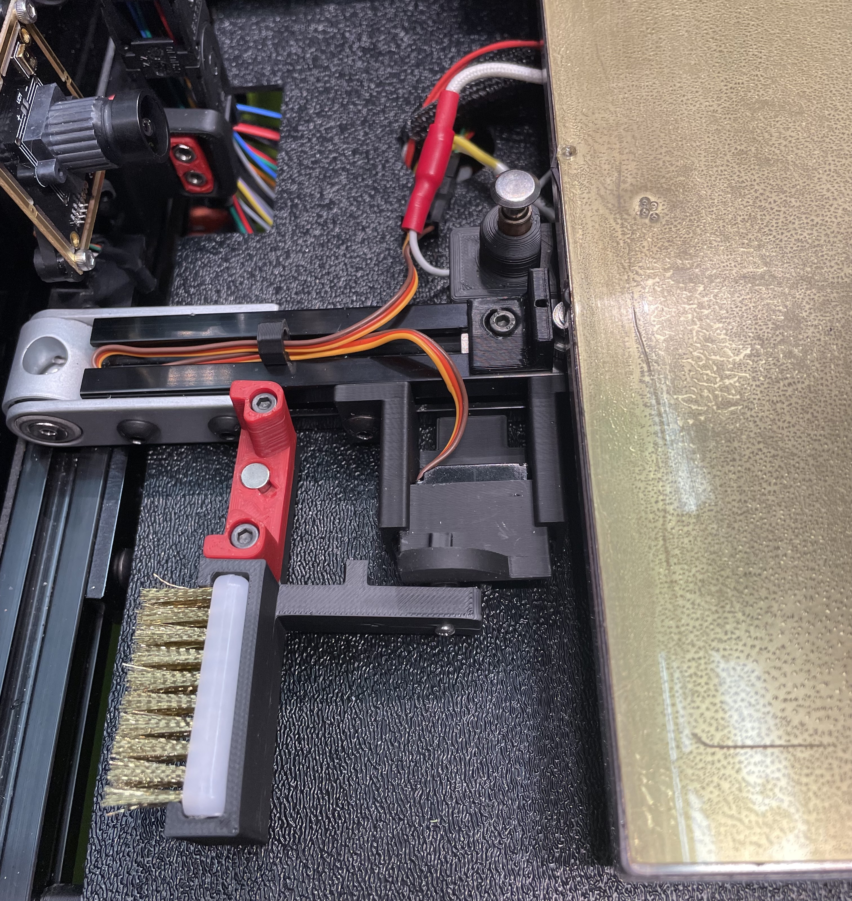

# A Servo-powered Retractable Dock for Klicky Probe and Nozzle Brush

## Background

I was not quite content with how the fixed nozzle worked. The back and forth motion of the nozzle either did not get the plastic bits off or got them off in one direction but picked them back up on the way back. Also, while I really like the Klicky probe, I had trouble consistently docking and undocking with the fixed Klicky probe dock on my Voron 2.4 350. Docking and undocking would work for a few print cycles then dock became slightly too far back for the toolhead to reach. So I created this servo-powered retractable dock and nozzle brush combo.

<table>
  <tr>
    <td>
       <a href="http://www.youtube.com/watch?v=YPCdNe6Fr9E" title="Servo-powered Nozzle Brush"></a>
    </td>
    <td>
      <a href="http://www.youtube.com/watch?v=sshtEy6dz7o" title="Servo-powered Klicky Dock"></a>
    </td>
  </tr>
</table>


Below is a comparison of the servo brush vs. the stock fix brush.
<table>
  <tr>
    <td>
  <figure>
  
  &nbsp;<br/>
  <figcaption align="center">Nozzle after cleaning with fixed brush</figcaption>
  </figure>
  </td>
  <td>
  <figure>
  
  &nbsp;<br/>
  <figcaption align="center">Nozzle after cleaning with the servo brush</figcaption>
  </figure>
  </td>
  </tr>
</table>
&nbsp;<br/>
&nbsp;<br/>
You can certainly choose to use this design for only the Klick probe dock or only the nozzle brush by skipping the parts and assembly for the respective functionality. 


## BOM

Common:
* 1 x SG90 12g servo with metal gears, such as this one https://www.amazon.com/dp/B08YY9KLVV
* 3 x 22-26 AWG wires at a length that can reach from the servo mounted by the print bed to your MCU
* 1 x JST XH Connector Plug 3 Position (for connecting to MCU)
* 1 x MicroFit3 Connector Receptacle 3 Position (for the other end of cable from MCU)
* 1 x MicroFit3 Connector Plug 3 Position (replace existing connector on the servo)
* 2 x M5x10mm BHCS screws  (for mounting the housing to the extrusion)
* 2 x M5 Spring T-nuts (for mounting the housing to the extrusion)
* 1 x M2x6mm screw (for securing the dock adaptor arm to the servo)

Klicky probe dock:
* 2 x M3x5mmx4mm heat inserts (for the dock adaptor arm)
* 2 x M3x20mm screws (for securing the dock to the dock adaptor arm, the same two screws used in the stock fixed dock setup)

Nozzle brush:
* 1 x Brass nozzle brush, such as this one https://www.amazon.com/gp/product/B092HWQG69. Of course, you can use a nozzle brush made of other materials, such as a silicone brush. But the current  brush holder has been tested for fit with brass nozzle from Amazon listed above.

## Assembly

### Setup the servo config
* Copy the retractable_probe_dock.cfg  to the directory where your printer.cfg file is (e.g., /home/pi/).

* In your printer.cfg file, also add the following [include retractable_probe_dock.cfg]. You can add it right after [include klicky-probe.cfg]. For example, this is what it looks like in my printer.cfg.
```
#####################################################################
# 	Macros
#####################################################################
[include klicky-probe.cfg]
[include retractable_probe_dock.cfg]
[include z_calibration.cfg]
```

* Add the following to your printer.cfg.

```
[servo probe_dock_servo]
pin: P2.0            # P2.0 is for Skr 1.4, use the appropriate pin for your MCU
#   PWM output pin controlling the servo. This parameter must be
#   provided.
maximum_servo_angle: 180
#   The maximum angle (in degrees) that this servo can be set to. The
#   default is 180 degrees.
minimum_pulse_width: 0.0005
#   The minimum pulse width time (in seconds). This should correspond
#   with an angle of 0 degrees. The default is 0.001 seconds.
maximum_pulse_width: 0.0025
#   The maximum pulse width time (in seconds). This should correspond
#   with an angle of maximum_servo_angle. The default is 0.002
#   seconds.
initial_angle: 175
#   Initial angle (in degrees) to set the servo to. The default is to
#   not send any signal at startup.
#initial_pulse_width:
#   Initial pulse width time (in seconds) to set the servo to. (This
#   is only valid if initial_angle is not set.) The default is to not
#   send any signal at startup.
```
* Add extend_probe_dock and retract_probe_dock commands to attach_probe and dock_probe macros in your klicky-probe.cfg. See example below for where to insert.
```
[gcode_macro Attach_Probe]

        ...

        _entry_point function=Attach_Probe_intern

        # RETRACTABLE BEGIN
        extend_probe_dock
        # RETRACTABLE END
        
        # Probe entry location
        G0 X{docklocation_x|int - attachmove_x|int} Y{docklocation_y|int - attachmove_y|int} F{travel_feedrate}
        
            G0 Z{docklocation_z|int - attachmove_z|int} F{dock_feedrate}
        

        # Drop Probe to Probe location
        
            G0 Z{docklocation_z} F{dock_feedrate}
        
        G0 X{docklocation_x} Y{docklocation_y} F{dock_feedrate}

        # Probe Attach
        
        G0 Z{docklocation_z|int - attachmove_z|int} F{z_drop_feedrate}
        
        G0 X{docklocation_x|int - attachmove_x|int} Y{docklocation_y|int - attachmove_y|int} F{release_feedrate}

        # RETRACTABLE BEGIN
        retract_probe_dock
        # RETRACTABLE END
        
        # Go to Z safe distance
        

        ...
        
[gcode_macro Dock_Probe]
    ...

        _Umbilical_Path

        # RETRACTABLE BEGIN
        extend_probe_dock
        # RETRACTABLE END
        
        # Probe entry location
        G0 X{docklocation_x|int - attachmove_x|int} Y{docklocation_y|int - attachmove_y|int} F{travel_feedrate}
        
            G0 Z{docklocation_z|int - attachmove_z|int} F{dock_feedrate}
        

        # Drop Probe to Probe location
        G0 X{docklocation_x} Y{docklocation_y} F{dock_feedrate}
        
            G0 Z{docklocation_z} F{dock_feedrate}
        

        # Probe decoupling
        
            G0 Z{docklocation_z|int + dockmove_z|int} F{release_feedrate}
        
        G0 X{docklocation_x|int + dockmove_x|int} Y{docklocation_y|int + dockmove_y|int} F{release_feedrate}
        
        # RETRACTABLE BEGIN
        # RETRACTABLE adds the move below to move it back within max_bed_y
        G0 Y{docklocation_y|int - attachmove_y|int} F{release_feedrate}
        retract_probe_dock
        # RETRACTABLE END
        
        # Go to Z safe distance
        
        
        ...        
```
### Wiring the servo to the MCU
* Power off the printer.
* Attach the servo to the servo port on your MCU. For example, on a SKR 1.4 Turbo, the servo port is the one inside the orange box shown in the picture below. 
<table>
  <tr>
    <td width="50%">

  </td>
  <td>
The three pins from the servo port labeled GND, NPWR, and 2.0 should be connected to the Negative Pole (Brown), Positive Pole (Red), and Signal (Yellow) pins of the Micro Servo as shown in the picture below.

  </td>
  </tr>
</table>

* Crimp the MicroFit3 Connector Receptacle onto the wires from mcu.
* Cut off the existing connector on the servo.
* Crimp the MicroFit3 Connector Plug onto the servo wires.

### Install the nozzle brush (skip if you are not using the Klicky probe dock feature)
* Heat set the two heat inserts.

* Install the probe dock using the two M3 screws (the same ones for the stock dock mount).

### Install the nozzle brush (skip if you are not using the nozzle brush feature)
* Trim the nozzle brush so that it fits in the holder.

* Insert the trimmed brush into the holder.



### Final assembly
* Install the servo into the housing using the two self-threading screws that come with the servo.

* Install the impact shield by pushing it all the way into the housing.

* Put the two spring T-nuts in the extrusion and mount the housing to the extrusion (about 40 mm from the print bed on a V2.4 350). Don't tighten them too much. We will want to adjust the distance from the housing to the edge of the print bed.
* Connect the servo to the wires from the MCU.
* Power on the printer. If you have correctly inserted [servo probe_dock_servo] section into your printer.cfg, you should see the servo moving to the initial angle (e.g., 175 deg. in the sample setup) position up on boot up.
* Type the following command in a terminal to Klipper (e.g., under Octoprint's terminal tab): retractable_probe_dock.
(You should hear some clicking sound but the servo gear may not spin because it is at its initial angle position.)
* Attach the white plastic wing that came with the servo to the top of the servo. You can just press it down but don't need to screw it in yet.

* Put the dock adaptor arm over the white plastic wing, and secure the arm using a M2 6mm machine screw.


### Initial configuration
* First, do a G28 to home everything.
* Do a few extend_probe_dock and retract_probe_dock to make sure the servo is working correctly.
### Skip the following steps if you are not using the Klicky probe dock feature
* Do a extend_probe_dock, then g0 z40.
* Then move your toolhead to be right above the extended dock using the G0 X__ Y__. 
* Slowly lower the z until the probe holder in the toolhead makes contact with the probe
* Do a GET_POSITION to get the X Y Z positions.
* Update klicky-probe.cfg with the positions (see example setup below)
```
variable_docklocation_x:        63    # X Dock position
variable_docklocation_y:        325   # Y Dock position
variable_docklocation_z:        9     # Z dock position (-128 for a gantry mount)

```
* Save the updated klicky-probe.cfg and do a FIRMWARE_RESTART
* Do a G28 to home XYZ
* Do an attach_probe and a dock_probe to see the retractable dock working as intended.

#### Skip the following steps if you are not using the nozzle brush feature
* Do an extend_probe_dock
* Move the nozzle until the x is at the brush start and y is at brush_front
```
                  ←   brush_width   →                            
                   _________________                                                          ↑                 |                 |  ↑                     
  brush_start (x) |                 | brush_depth            
                  |_________________|  ↓                                      
                          (y)                                                                
↓                      brush_front
 __________________________________________________________
                     PRINTER FRONT
```

* Do a GET_POSITION and update retractable_probe_dock.cfg (see example setup below)
```
variable_brush_front:       340          
variable_brush_depth:       10       
``` 
* Do a FIRMWARE_RESTART followed by a G28 to home everything
* Do a cleaning_nozzle to see the brushing in action