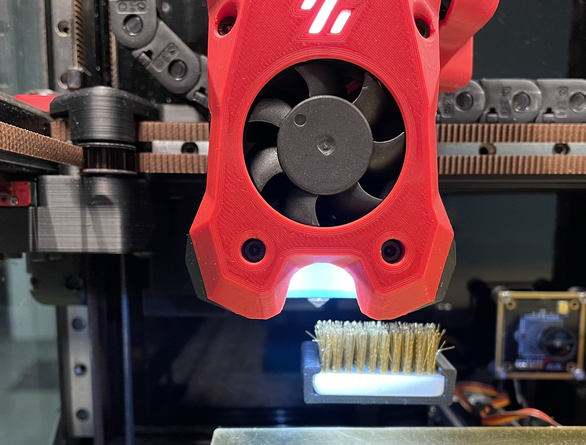
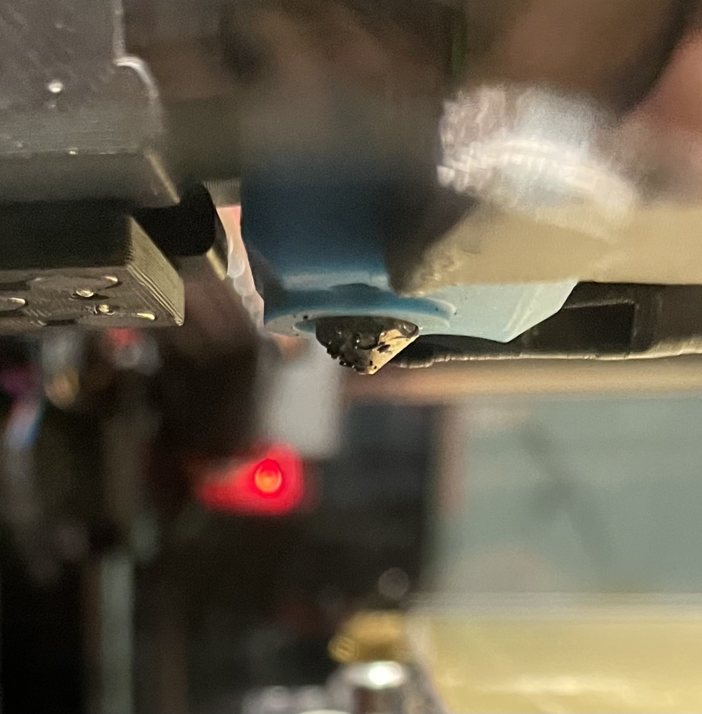
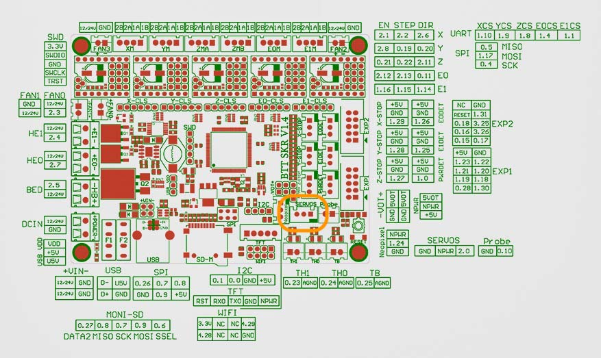
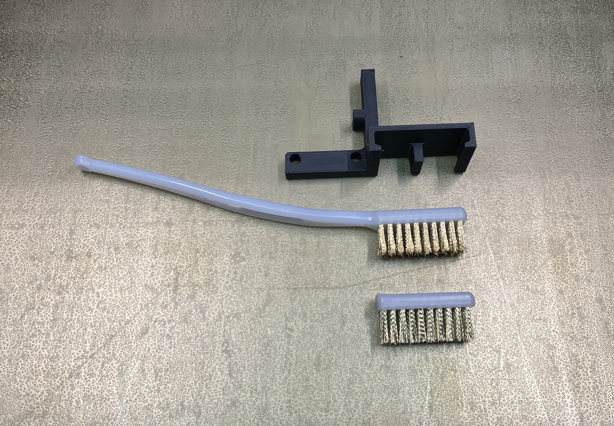
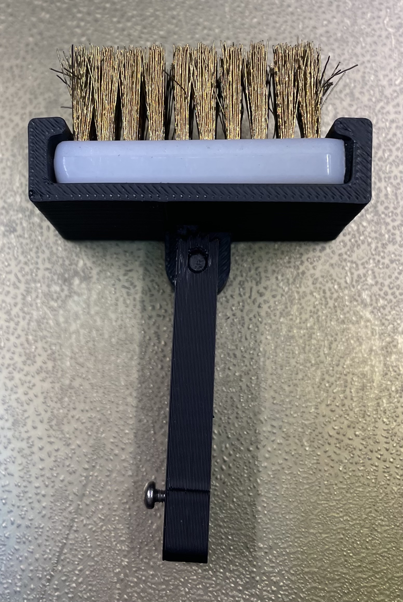
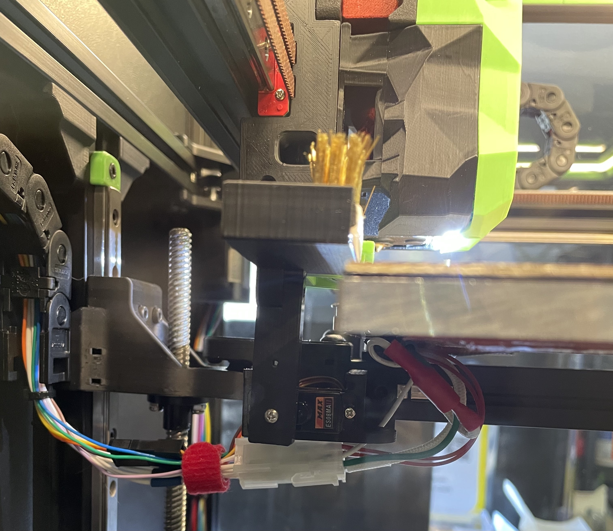
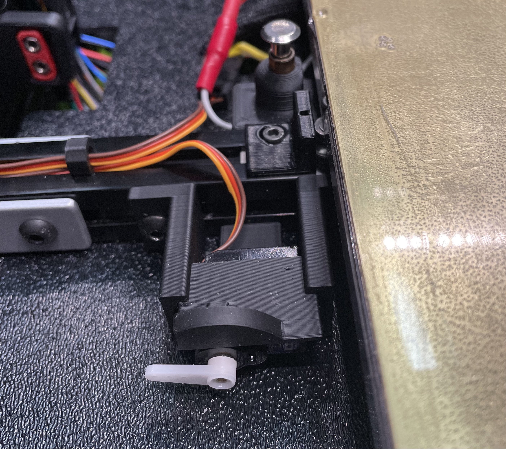

# A Servo-powered Nozzle Brush
## for Voron 2.4 and Trident

<table>
  <tr>
    <td>
       
    </td>
  </tr>
</table>

## Background

I was not quite content with how the fixed nozzle worked. The back and forth motion of the nozzle either did not get the plastic bits off or got them off in one direction but picked them back up on the way back. Also, after upgrading to TAP on my Voron 2.4 350, I had trouble getting the nozzle to reach fixed-position brushes. So I created this servo-powered nozzle brush based on my prior retractable Klicky probe dock.

<table>
  <tr>
    <td>
       <a href="http://www.youtube.com/watch?v=YPCdNe6Fr9E" title="Servo-powered Nozzle Brush"></a>
    </td>
  </tr>
</table>


Below is a comparison of the servo brush vs. the stock fix brush.
<table>
  <tr>
    <td>
  <figure>
  
  &nbsp;<br/>
  <figcaption align="center">Nozzle after cleaning with fixed brush</figcaption>
  </figure>
  </td>
  <td>
  <figure>
  
  &nbsp;<br/>
  <figcaption align="center">Nozzle after cleaning with the servo brush</figcaption>
  </figure>
  </td>
  </tr>
</table>
&nbsp;<br/>
&nbsp;<br/>

This design was based on the retractable Klick probe dock but only for the nozzle brush. 


## BOM

Common:
* 1 x SG90 12g analog servo with metal gears, such as this one https://www.amazon.com/gp/product/B07KYK9N1G/
* 3 x 22-26 AWG wires at a length that can reach from the servo mounted by the print bed to your MCU
* 1 x JST XH Connector Plug 3 Position (for connecting to MCU)
* 1 x MicroFit3 Connector Receptacle 3 Position (for the other end of cable from MCU)
* 1 x MicroFit3 Connector Plug 3 Position (replace existing connector on the servo)
* 2 x M5x10mm BHCS screws  (for mounting the housing to the extrusion)
* 2 x M5 Spring T-nuts (for mounting the housing to the extrusion)
* 1 x M2x6mm screw (for securing the servo adaptor arm to the servo)

---
**NOTE**

A digital servo would work also. But some digital servos may flutter during extension (i.e., rapid vibrating as it tries to find the precise angle). An analog servo does not have this problem.

---

Nozzle brush:
* 1 x Brass nozzle brush, such as this one https://www.amazon.com/gp/product/B092HWQG69. Of course, you can use a nozzle brush made of other materials, such as a silicone brush. But the current  brush holder has been tested for fit with brass nozzle from Amazon listed above.

## Assembly

### Setup the servo config
* Copy servo_arm.cfg and servo_nozzle_brush.cfg to the directory where your printer.cfg file is (e.g., /home/pi/).

* In your printer.cfg file, also add the following [include servo_nozzle_brush.cfg]. For example, this is what it looks like in my printer.cfg.
```
#####################################################################
# 	Macros
#####################################################################

[include servo_nozzle_brush.cfg]
```

* Add the following servo section to your printer.cfg.

```
[servo arm]
pin: P2.0            # P2.0 is for Skr 1.4, use the appropriate pin for your MCU
#   PWM output pin controlling the servo. This parameter must be
#   provided.
maximum_servo_angle: 180
#   The maximum angle (in degrees) that this servo can be set to. The
#   default is 180 degrees.
minimum_pulse_width: 0.0005
#   The minimum pulse width time (in seconds). This should correspond
#   with an angle of 0 degrees. The default is 0.001 seconds.
maximum_pulse_width: 0.0025
#   The maximum pulse width time (in seconds). This should correspond
#   with an angle of maximum_servo_angle. The default is 0.002
#   seconds.
initial_angle: 175
#   Initial angle (in degrees) to set the servo to. The default is to
#   not send any signal at startup.
#initial_pulse_width:
#   Initial pulse width time (in seconds) to set the servo to. (This
#   is only valid if initial_angle is not set.) The default is to not
#   send any signal at startup.
```

### Wiring the servo to the MCU
* Power off the printer.
* Attach the servo to the servo port on your MCU. For example, on a SKR 1.4 Turbo, the servo port is the one inside the orange box shown in the picture below. 
<table>
  <tr>
    <td width="50%">
        
    </td>
  <td>
The three pins from the servo port labeled GND, NPWR, and 2.0 should be connected to the Negative Pole (Brown), Positive Pole (Red), and Signal (Yellow) pins of the Micro Servo as shown in the picture below.

  </td>
  </tr>
</table>

* Crimp the MicroFit3 Connector Receptacle onto the wires from mcu.
* Cut off the existing connector on the servo.
* Crimp the MicroFit3 Connector Plug onto the servo wires.


### Install the nozzle brush (skip if you are not using the nozzle brush feature)
* Trim the nozzle brush so that it fits in the holder.


* Insert the trimmed brush into the holder.


### Final assembly
* Install the servo into the housing using the two self-threading screws that come with the servo.



* Put the two spring T-nuts in the extrusion and mount the housing to the extrusion (about 40 mm from the print bed on a V2.4 350). Don't tighten them too much. We will want to adjust the distance from the housing to the edge of the print bed.
* Connect the servo to the wires from the MCU.
* Power on the printer. If you have correctly inserted [servo arm] section into your printer.cfg, you should see the servo moving to the initial angle (e.g., 175 deg. in the sample setup) position up on boot up.
* Type the following command in a terminal to Klipper (e.g., under Octoprint's terminal tab): retract_arm.
(You should hear some clicking sound but the servo gear may not spin because it is at its initial angle position.)
* Attach the white plastic wing that came with the servo to the top of the servo. You can just press it down but don't need to screw it in yet.


* Put the servo adaptor arm over the white plastic wing, and secure the arm using a M2x6mm machine screw.
---
**NOTE**

You should use a small dab of Loctite (I used the red variety) on the the M2 screw to avoid having to re-tighten it periodically.

---

### Initial configuration
* First, do a G28 to home everything.
* Do a few extend_arm and retract_arm to make sure the servo is working correctly.
* Do an extend_arm
* Move the nozzle until the x is at the brush start and y is at brush_front
```
                  ←   brush_width   →                            
                   _________________                                                          ↑                 |                 |  ↑                     
  brush_start (x) |                 | brush_depth            
                  |_________________|  ↓                                      
                          (y)                                                                
↓                      brush_front
 __________________________________________________________
                     PRINTER FRONT
```

* Do a GET_POSITION and update servo_nozzle_brush.cfg (see example setup below)
```
variable_brush_front:       340          
variable_brush_depth:       10       
``` 
* Do a FIRMWARE_RESTART followed by a G28 to home everything
* Do a cleaning_nozzle to see the brushing in action

