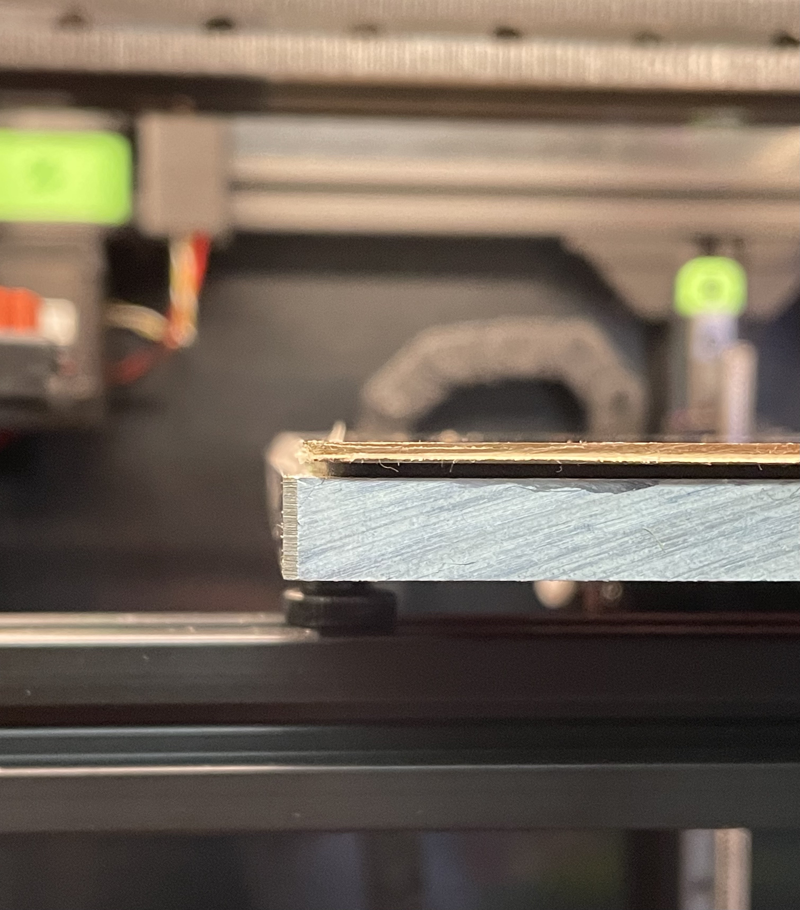
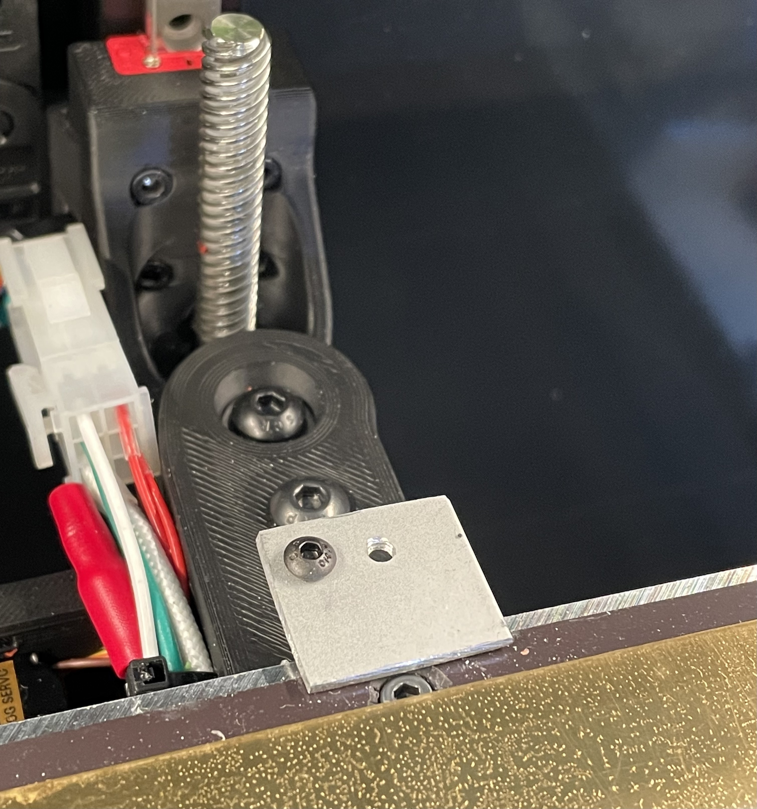

# Auto 3-Axes Calibration

https://youtu.be/E4-BblkuyVQ
https://youtu.be/gSlykigIngY

## What it is
This is a collection of Klipper modules and macros that will automatically find the x, y, and z offsets between tool head 1 (T1) and tool head 0 (T0) in an IDEX setup.

## Requirements
You need to to have double-tap installed. 

**_NOTE:_**  JosAr, the creator has a made Unklicky adaptor that may work with this setup. But I have not tested it. The CAD is in the experimental directory.

For the z offset calibration, there is nothing extra you need. But for the x and y offsets calibration, you need to have x-edge(s) and y-edge(s) that are reachable by both nozzles. Currently, I have tested the code with two approaches. 

1. If you happen to use a build plate that is smaller than your aluminum bed, then you can use the edges of your build plate. If you go with this approach, then you will be using the left edge for your T0 nozzle probing and right edge for your T1 nozzle to calibrate the idex x offset. You will use the back edge for both T0 and T1 to calculate the y offset.

 

2. You can also use an object with clean edges to use as a calibration tool. Below are pictures of a calibration tool that I made from a 2mm-thick aluminum L bar.
<table>
  <tr>
    <td>
       
    </td>
    <td>
      
    </td>
  </tr>
</table>

Depending on the approach you pick, you will need to adjust the parameters in the [idex_offsets_calibration] section (discussed below) of your printer.cfg accordingly.

## How it works
This is a slightly simplified version of what the code does. For the z offset is calculated by probing the surface height at the same location on the bed using nozzles on T0 and T1, and then subtract the two reported z heights. For the x and y offsets, the code will probe a designated edge (or edges) using nozzles on T0 and T1, and then subtract the reported x-positions or y-positions to determine the x offset or y offset, respectively.


> **WARNING**
> This code is still very beta. Because it relies on probing edges with your nozzles, there is a potential for damaging your nozzle or the bed surface or both. If you use this code, then you are assuming all associated risks!!! 


## How to install it

1. Copying named_probe.py, query_named_probe.py, and idex_offsets_calibration.py into klipper/klippy/extras directory.
2. Copy idex_offsets_helpers.cfg into the same directory as your printer.cfg (or which ever directory you choose as long as you can include the idex_offsets_helpers.cfg from your printer.cfg)

### How to configure it
Edits to your printer.cfg:
1. Add [include idex_offsets_helpers.cfg]
2. Comment out or delete the [probe] section.
2. Add [named_probe] sections. For example, on my Tridex set up. I have two named_probe sections: [named_probe tap1] and [named_probe tap0] 
NOTE: Currently, due to the way Klipper parses the config file, the last [named_probe] in your printer.cfg is the initial/default probe. So you will want to list your probe attached to T0 last.
3. Add a [idex_offsets_calibration] section. Below is an example taken from my printer.cfg.

```
[idex_offsets_calibration]
# offset_x parameters (mm)
# probing the calibration object on the back edge
offset_x_probe_site_t0_x:    132
#offset_x_probe_site_t1_x:    130           ; default to offset_x_probe_site_t0_x
offset_x_probe_site_y:       252.5
#offset_x_probe_site_z:       0             ; default 0
offset_x_step_size_t0:         0.50        ; how much to move each step initially, when doing offset_x calibration
#offset_x_step_size_t1:         0.50        ; default to offset_x_t0_step_size
# offset_x = T1_x - probe_differential_x - T0_x, default 0
# T1 color too far +X (right) => increase probe_differential_x
# T1 color too far -X (left)  => decrease probe_differential_x
probe_differential_x:          0.1

# probing left and right edges of the PEI sheet
#offset_x_probe_site_t0_x:     0
#offset_x_probe_site_t1_x:   245
#offset_x_probe_site_y:      125
#offset_x_probe_site_z:        0           ; default 0
#offset_x_step_size_t0:       -0.50        ; how much to move each step initially, when doing offset_x calibration
#offset_x_step_size_t1:        0.50        ; default to offset_x_t0_step_size
# offset_x = T1_x - probe_differential_x - T0_x, default 0
#probe_differential_x:       251.05        


# offset_y parameters (mm)
# probing the calibration object on the back edge
offset_y_probe_site_t0_x:     130
#offset_y_probe_site_t1_x:     75            ; default to offset_y_probe_site_t0_x
offset_y_probe_site_y:        252.5
#offset_y_probe_site_z: 0                    ; default 0
offset_y_step_size_t0:         -0.50        ;how much to move each step initially, when doing offset_y calibration
#offset_y_step_size_t1:         -0.50        ; default to offset_y_t0_step_size

# offset_y = T1_y - probe_differential_y - T0_y, default 0
# T1 color too far +Y (back)  => increase probe_differential_y
# T1 color too far -Y (front) => decrease probe_differential_y
probe_differential_y:          0.088             

# probing back edge of the PEI sheet
#offset_y_probe_site_t0_x:      200
#offset_y_probe_site_t1_x:       75               ; default to offset_y_probe_site_t0_x
#offset_y_probe_site_y:         249
#offset_y_probe_site_z:         0                   ; default 0
#offset_y_step_size_t0:         0.50         ;how much to move each step initially, when doing offset_y calibration
#offset_y_step_size_t1:         0.50        ; default to offset_y_t0_step_size
# offset_y = T1_y - probe_differential_y - T0_y, default 0
#probe_differential_y:          0.15               ; 

# offset_z parameters (mm)
offset_z_probe_site_x:        125
offset_z_probe_site_y:        125
#offset_z_probe_site_z:         0                   ; default 0
# offset_z = T1_z - probe_differential_z - T0_z, default 0
# T0 perfect, T1 too far from bed => increase probe_differential_z
# T0 perfect, T1 too close to bed => decrease probe_differential_z
probe_differential_z:           0.635

# general parameters (mm)
edge_threshold:                 0.25         ; if the differences between successive probing is larger, then we found the edge
edge_probing_distance:         10            ; how far to probe for
clearance:                     10            ; in z, default 20
sample_retract_dist:            2
samples:                        1
```

4. In [stepper_z] section of your printer.cfg, change 
    `endstop_pin: probe:z_virtual_endstop` 
  to 
    `endstop_pin: named_probe:z_virtual_endstop`
    
5. Add [named_probe] sections, one per each probe. Klipper parses the printer.cfg file top to bottom. Therefore, the last [named_probe] will be the default probe. As a result, I recommend you put your T0 probe after your T1 probe in the configuration file. Below is an example taken from my current print.cfg file.

```
[named_probe tap1]
pin: head1:gpio28
idex_carriage: 1               ; 0 or 1
x_offset: 0
y_offset: 0
z_offset: -1.150
speed: 10.0
samples: 3
samples_result: median
sample_retract_dist: 3.0
samples_tolerance: 0.006
samples_tolerance_retries: 3

activate_gcode:
    
    
    
    

    
        { action_respond_info('Extruder temperature target of %.1fC is too high, lowering to %.1fC' % (TARGET_TEMP, PROBE_TEMP)) }
        M109 S{ PROBE_TEMP }
    
        # Temperature target is already low enough, but nozzle may still be too hot.
        
            { action_respond_info('Extruder temperature %.1fC is still too high, waiting until below %.1fC' % (ACTUAL_TEMP, MAX_TEMP)) }
            TEMPERATURE_WAIT SENSOR=extruder MAXIMUM={ MAX_TEMP }
        
    

[named_probe tap0]
pin: head0:gpio28
idex_carriage: 0               ; 0 or 1
# Voron Tap
# Increasing z_offset brings nozzle closer to the bed
x_offset: 0
y_offset: 0
z_offset: -1.150   ;   -1.200  ; -1.250
speed: 10.0
samples: 3
samples_result: median
sample_retract_dist: 2.0
samples_tolerance: 0.006
samples_tolerance_retries: 3

activate_gcode:
    
    
    
    

    
        { action_respond_info('Extruder temperature target of %.1fC is too high, lowering to %.1fC' % (TARGET_TEMP, PROBE_TEMP)) }
        M109 S{ PROBE_TEMP }
    
        # Temperature target is already low enough, but nozzle may still be too hot.
        
            { action_respond_info('Extruder temperature %.1fC is still too high, waiting until below %.1fC' % (ACTUAL_TEMP, MAX_TEMP)) }
            TEMPERATURE_WAIT SENSOR=extruder MAXIMUM={ MAX_TEMP }
        
    
```

## How to use it


### Commands
#### QUERY_PROBE
This command queries the current active probe. The output includes the name of the current active probe in addition to information returned from the stock QUERY_PROBE command.
```
Send: query_probe
Recv: // probe tap0: open
```

#### QUERY_PROBES
This is a new command added to Klipper. You can think of it as the probe equivalent to query_endstops. It displays the status of all configured named probes.
```
Send: query_probes
Recv: tap1:open tap0:open
```

#### ACTIVATE_PROBE PROBE=<probe name>
Activates the named probe.

To activates the probe named tap1 defined by [named_probe tap1]:
```
Send: ACTIVATE_PROBE PROBE=tap1
Recv: // Probe tap1 activated
```

#### ACTIVATE_IDEX_PROBE CARRIAGE=0|1
Activates the probe configured for the respective carriage. For this command to work, you need to define idex_carriage in the [named_probe] section.

To activates the probe configured for carriage 1 a.k.a, the T1 carriage:
```
Send: ACTIVATE_IDEX_PROBE CARRIAGE=1
Recv: // Probe tap1 on carriage 1 activated
```

#### CALIBRATE_IDEX_OFFSETS [SKIP=<axes-to-skip>] [APPLY=1|0]
By default CALIBRATE_IDEX_OFFSETS will calibrate all three axes. But you can skip one or more axes by specifying the optional SKIP parameter.
For example: 

    CALIBRATE_IDEX_OFFSETS SKIP=z     # will skip calibrating z axis
    CALIBRATE_IDEX_OFFSETS SKIP=y,z   # will skip calibrating y and z axes


#### CALIBRATE_IDEX_OFFSET_X [APPLY=1|0]
This is a convenience command that is equivalent to CALIBRATE_IDEX_OFFSETS SKIP=y,z.

#### CALIBRATE_IDEX_OFFSET_Y [APPLY=1|0]
This is a convenience command that is equivalent to CALIBRATE_IDEX_OFFSETS SKIP=x,z.

#### CALIBRATE_IDEX_OFFSET_Z [APPLY=1|0]
This is a convenience command that is equivalent to CALIBRATE_IDEX_OFFSETS SKIP=x,y.

#### SHOW_IDEX_OFFSETS
Displays current idex offsets in use and the last calibrate offsets from running one of the CALIBRATE_IDEX_OFFSET* commands. Current idex offsets are the offsets initially defined in DC_VARS found in the IDEX_mode.cfg file but can be subsequently modified using the UPDATE_IDEX_OFFSETS command.

#### UPDATE_IDEX_OFFSETS [OFFSET_X=<val>|SKIP] [OFFSET_Y=<val>|SKIP] [OFFSET_Z=<val>|SKIP]
Updates current idex offsets that will govern the next print job. By default, without any parameters, this command will update the current offset from the last calibrated offsets. 

The optional parameters OFFSET_X, OFFSET_Y, and OFFSET_Z can be used to supply a offset value instead of using the last calibrate offsets. If you supply the word SKIP instead of a number to these parameters, then the offset for the relevant axis will not be updated.
```
     UPDATE_IDEX_OFFSETS                   # updates all three offsets
     UPDATE_IDEX_OFFSETS OFFSET_X=0.120    # will set offset_x to 0.120 but use last 
                                           # calibrated y and z values
     UPDATE_IDEX_OFFSETS OFFSET_Z=SKIP     # will not update offset_z but update y and z
                                           # from the last calibrated values
```